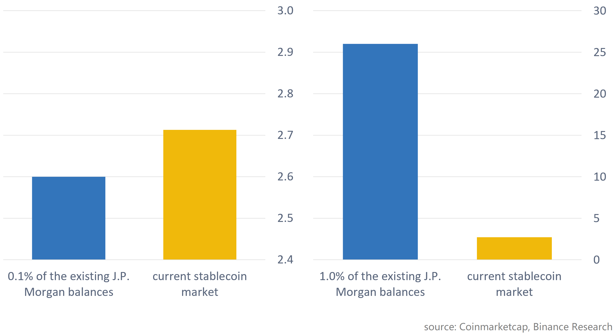
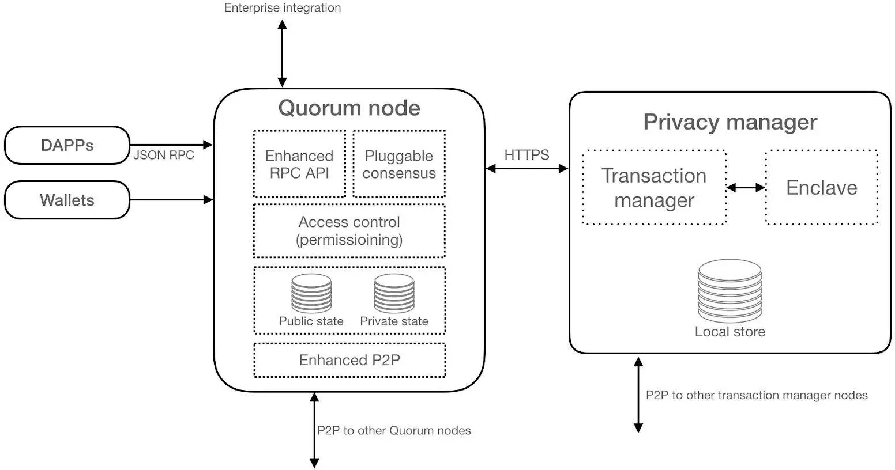

# JPM COIN
---
By Lam Nguyen

## OVERVIEW & ORIGIN
---

https://www.jpmorgan.com/global/news/digital-coin-payments
https://www.macrotrends.net/stocks/charts/JPM/jpmorgan-chase/free-cash-flow

JPMorgan Chase & Co. is one of the oldest yet largest financial institutions in the United States, founded by Jamie Dimon and incorporated on December 1st, 2020. In February 2019, the firm announced the creation of their own dollar-backed digital currency, called JPM Coin.

JPM Coin is a digital, fiat currency that hopes to transform payments between institutional customers through the use of blockchain technology. It provides instantaneous payment at the same time as smart contracts' closure, which addresses the delayed settlement time faced by traditional wire transfer option. The idea's origin is seen as JPMorgan Chase's attempt to catch up with the technological disruption in the finance industry, even when such attempt goes against their own words of previous opposition to cryptocurrencies. JPM Coin announcement makes JPMorgan Chase the pioneer of all large financial instituations in the U.S. fintech industry to ever do anything like the creation of their coin. While its future development is yet to be seen, this attempt brings hope to the firm in an attempt to better ensure the company's future in capturing technology disruption to the traditional finance landscape.

While it is unclear whether exactly how much the company invested in the creation of the new coin, its financial statements give us some hints about how dedicated JPMorgan Chase has been in the research and development of this product and bringing it into real practice.

![JPMorgan Chase's 2019 Annual Report, Consolidated Cash Flow analysis][./images/cf.png]

In JPMorgan Chase's 2019 Annual Report, the company's cash flow analysis stated that their free cash flow dropped 57.38% from $14,187B in 2018 to $6,046B in 2019, in which both numbers accounted for the company's spending in operating activities, signaling the company's investment in organic development. But money wasn't everything that the firm needed to invest into the project. Throughout the development of JPM Coin, the firm has been actively recruiting employees through their internship and associate program, offering multiple positions in direct relation with blockchain technology, while seemingly forming partnerships with fintech infrastructure designers and engineers.

## BUSINESS ACTIVITIES
---

### What specific financial problem is the company or project trying to solve?
https://www.jpmorgan.com/global/news/digital-coin-payments

JPMorgan Chase wants to transform itself trying to disrupt its traditional payment method through digital currency payments between institutional banks, with the hope to solve the delayed trade settlement time after every smart contract and to add further regulation and security to the new method of digital transfer.

As JPMorgan Chase clearly stated that their stance over the cryptocurrencies remains supportive as long as proper regulations and control are implemented, their new digital currency also strived its best to meet such expectations. Specifically, JPM Coin is believed to solve 4 main concerns while benefiting the customers, as retrieved from their digital coin payments website:

> 1. **Strong Balance Sheet** of $2.6 trillion ensures stability and fiat
> 2. **Security & Innovation** upheld by millions of dollars on cybersecurity each year and a Blockchain Center of Excellence
> 3. **Strong Controls & Compliance** through AML and KYC controls
> 4. **Regulatory Oversight** through the compliance with banking laws and regulations and supervision of baking regulators and international jurisdictions

### Who is the company's intended customer?  Is there any information about the market size of this set of customers?
https://research.binance.com/en/analysis/jpmcoin

The intended customers are now limited to institutional customers, meaning that the current deployment of JPM Coin is private and internal and a mass introduction to the public or individual customers stays out of the firm's plan.

Because of JP Morgan's position as one of the largest banks in the world, JPM Coin can cover a huge market capitalization of stablecoin that may make the firm "*the largest stablecoin issuer on a blockchain*" with just one small and limited issuance. This naturally creates a competitive advantage for JPMorgan Chase but it is vital that the company must keep in mind that any other mega bank of their size can do exactly the same to become JPM Coin's direct competitor.

The current stablecoin market size falls around $2.7B, meaning that 0.1% of JP Morgan Chase's balance sheet of $2.6T would make up roughly 96% of the current market size. If the first issuance of this new yet giant entrant falls around 0.1%, 49% of the future stablecoin market would be made up of JPM Coin, far outweighing any other rivals existing in the market.

### What solution does this company offer that their competitors do not or cannot offer? (What is the unfair advantage they utilize?)
https://research.binance.com/en/analysis/jpmcoin

The nature of an incumbent financial institution makes up most of JPM Coin's advantage that its competitors may have little to no chance to compete. But the chances are that JPM Coin will stay in its institutional market for quite a while and such difference in market choice will leave the current participants serving individual customers more time to grow bigger and get more innovative to compete with this giant.

Considering a larger market of stable-coin, JPM Coin may hold a competitive position. As soon as JPM Coin decides to outreach the public market, its mass customer base with incredibly strong balance sheet would have the power to quickly surpass many of the existing competitors. It is undeniable that its readily available resources of capital, cybersecurity, customer base, and established reputation give the firm a great competitive edge in the stable-coin market. But things may change as other giants find their ways to enter the game.

When take a look into potential rivals, there may be less to say about JPM Coin advantages. JPMorgan Chase is obviously a large bank but it is also obvious that as soon as other mega financial institutions step in the game, JPMorgan Chase may see their advantage losing its power rapidly. Those new challengers can directly compete with JPMorgan Chase regarding capital resources, balance sheet, cybersecurity, and customer base. When this happens, their leverage of being either an pioneer or a huge bank will soon fail to help them thrive amid the competitiveness and increasing innovation from others. At this point of the competition, Jamie would be better hoping that the company's coin has made some improvements and differentiate-points to mark themselves out in the customers' eyes. 

### Which technologies are they currently using, and how are they implementing them? (This may take a little bit of sleuthing–– you may want to search the company’s engineering blog or use sites like Stackshare to find this information.)
https://blockgeeks.com/guides/quorum-a-blockchain-platform-for-the-enterprise/
https://research.binance.com/en/analysis/jpmcoin
https://www.coindesk.com/jpmorgan-has-quietly-rebooted-the-blockchain-tech-behind-its-jpm-coin

JPM Coin uses Quorum blockchain technology, which is an enterprise blockchain that is touched up with different enhancements to make the platform fit for business use. These enhancements are designed to meet the business needs and requirements of:
1. Confidentialy of transactions
2. Speed and scalability
3. Restricted access to authorized entities

Enterprise features are integrated into the Quorum architecture to perform and meet the fore-mentioned requirements in business operation. The Quorum architecture includes elements that are designed to specifically support the enterprise's need, including:

1. **Quorum Node**
Quorum nodes used in JPM Coin are forks (*blockchain network's splits*) of geth ("*a Go Programming Language implementation of Ethereum blockchain Geth*). Quorum nodes are continuously improved with inline updates while having its features modified to match enterprise clients' needs such as changes to block validation logic to handle 'Private Transactions'.

2. **Privacy Manager**
Privacy Manager or Private Transaction Manager allow the nodes to share transaction information securely between authorized parties within a transaction. Privay Manager is made up of transaction manager and enclave.
* **Transaction Manager**: JPM Coin's transaction's manager is Tessera, a Java system that can be used and deloyed easily by businesses to encrypt, decrypt, and distribute confidential transactions for Quorum.
* **Enclave**: Distributed Ledger protocols that can be used for transaction confidentiality, participant authentication, and data preservation.

## LANDSCAPE
---

https://www.researchgate.net/publication/342663281_Fintech%27s_Impact_on_Payments_Domain

JPM Coin is a future payment solution for institutions, developing in the fintech domain of billing and payment. Even though it is considered as one of the most mature domain in the industry with multiple startups and continuous innovations, this particular domain is still in its early phase of development. The major players in such field may name Paypal, Stripe, Square, and many more.

In the last 5-10 years, the global finance industry has been transforming towards a closer crossover with technology. Banks, food company, supply chain, billing solution companies,... all kinds of players have been attempting to innovate payments to increase convenience, boost accessibility, shorten settlement time, and enhance privacy and confidentiality. JPM Coin is one of such innovation but its future performance is wait to be seen.

## RESULTS
---

It is obvious that JPM Coin hasn't been out for use. They tested it but all that we have to say about the coin is just how contradict the idea of the coin is to their previous notion of cryptocurrencies. The company is the pioneer but not the pioneer of the industry. However, if done and developed properly, this JPM currency has the power to disrupt whatever there had already been in the banking landscape to bring JPMorgan to the top, or at least guarantee its position as one of the largest financial institution in the states.

Core metrics

## RECOMMENDATIONS
---

### If you were to advise the company, what products or services would you suggest they offer? (This could be something that a competitor offers, or use your imagination!)

While offering the JPM Coin exclusively to the institutional customers can be a great start, JPMorgan Chase, at some points, will face the need to introduce a product that is designed to serve the mass public and individual customers before their competitors take up all the market capitalization in the retail investors market.

JPMorgan Chase must keep in mind that any other financial institutions of their size and reputation can do whatever they are doing and the only way to tackle that challenge is to continuously innovate and disrupt their technology and services.

Additionally, fintech industry is a new industry that is made up of the 2 long-known fields of finance and technology. If possible, JPMorgan Chase should be looking for that kind of treasure that everyone else is missing, the hidden gem that lies in the future of fintech that is unique, is revolutionary, and is the only one of their kind.

### Why do you think that offering this product or service would benefit the company?

The company is trying to create a financial ecosystem that is developed under the name of Morgan Chase. Just like what Apple did in the mobile phone industry, it is clear that JPM Coin was trying to build a similar digital infrastructure starting with JPM Coin and it is possible that they may want to further step up for more fintech products of their own.

While it may benefit the company as JPM Coin is kept solely for circulation within the U.S., it may take more time and greater adaptation for the coin to integrate into the global financial system. No success comes in the first day but if JPMorgan Chase knows how to leverage their profounding advantages, JPM Coin will thrive.

